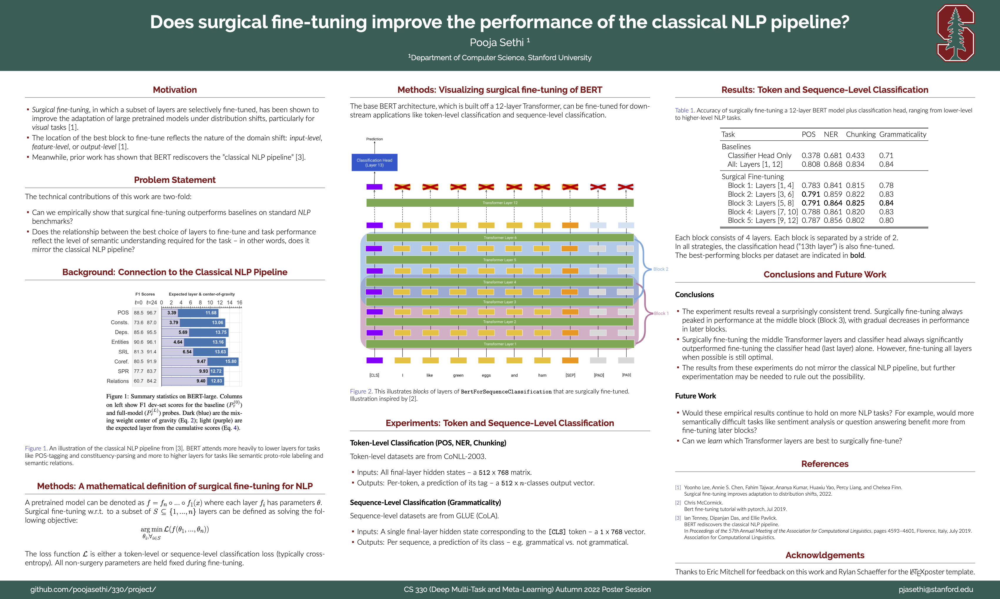

This is a class project for CS 330: Deep Multi-Task and Meta-Learning.

Here, I examine the benefits of surgical fine-tuning for NLP, and whether the results reflect the
"classical NLP pipeline".

Check out the poster or YouTube [video](https://youtu.be/bkVZYqq7fQY) for more details :)


# Environment Setup
```
conda create --name cs330-project python=3.9
conda activate cs330-project
pip install -r requirements.txt
```

# Training models
All results are saved under the `models/` directory.

Example usage:

## Sequence Classification
You can train a single model like this...

### CoLA
```
python main.py -m sequence -d glue-cola -p none --epochs 4 --batch-size 32
```

## Token Classification
Or multiple models like this...

### NER
```
python main.py -m token -d conll-ner -p group_1 --epochs 1 && \
python main.py -m token -d conll-ner -p group_2 --epochs 1 && \
python main.py -m token -d conll-ner -p group_3 --epochs 1 && \
python main.py -m token -d conll-ner -p group_4 --epochs 1 && \
python main.py -m token -d conll-ner -p group_5 --epochs 1 && \
python main.py -m token -d conll-ner -p none --epochs 1 && \
python main.py -m token -d conll-ner -p all --epochs 1
```

### Chunking
```
python main.py -m token -d conll-chunk -p group_1 --epochs 1 && \
python main.py -m token -d conll-chunk -p group_2 --epochs 1 && \
python main.py -m token -d conll-chunk -p group_3 --epochs 1 && \
python main.py -m token -d conll-chunk -p group_4 --epochs 1 && \
python main.py -m token -d conll-chunk -p group_5 --epochs 1 && \
python main.py -m token -d conll-chunk -p none --epochs 1 && \
python main.py -m token -d conll-chunk -p all --epochs 1
```

# Datasets
* CoLA (Corpus of Linguistic Acceptability): https://nyu-mll.github.io/CoLA/cola_public_1.1.zip
* CoNLL-2003: https://huggingface.co/datasets/conll2003
